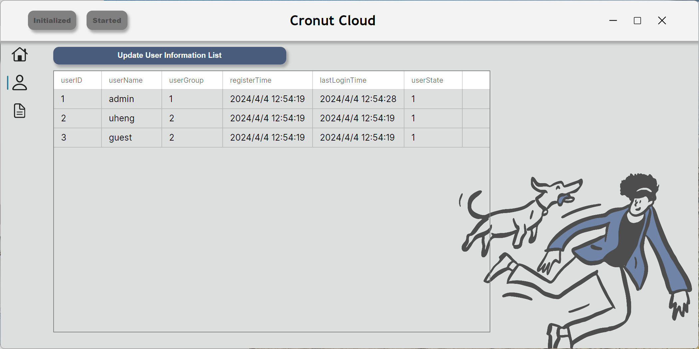
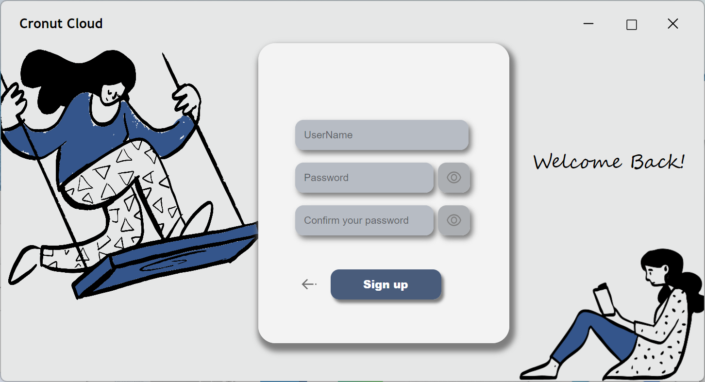
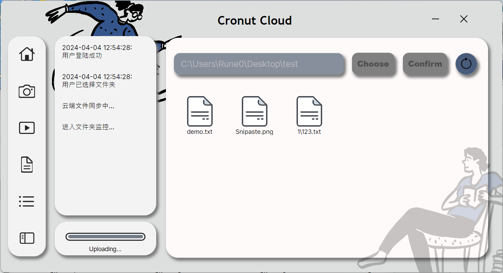

# Cronut

  

Cronut云盘是一款**端到端加密**且**跨平台**的同步云盘。基于自适应动态默克尔哈希森林算法，在端到端加密的前提下，支持不同用户间的**文件去重存储**和**重复文件秒传**。

##### 主要特性：

- 跨平台：支持Windows、 MacOS、 Linux。 本项目基于C#， 前端采用Avalonia框架， 后端使用SQLServer， 通信采用 Socket编程实现
- 文件去重：在加密的前提下，不同用户的相同文件仅占用一份云端空间， 节约服务方的存储成本。 且支持不同用户间的已有文件秒传， 提升上传体验
- 安全性：使用自适应动态默克尔哈希森林，并设计了基于此的所有权验证方案，大大提高了去重安全性

##### 创新：

本项目旨在解决云存储加密数据去重问题，即针对不同用户上传的同一份
文件，服务器可以进行重复性检测，对该文件仅保留一份副本。不仅对于服务
器而言，可以降低存储开销； 而且对于用户而言，可以大大减少传输开销。

经过调查和分析， 发现现有方案存在诸多局限性，比如：不能抵抗离线穷
举攻击，会暴露文件信息等。基于此，设计了一种名为自适应动态默克尔哈希
森林（ ADMHF） 的数据结构，并设计了基于 ADMHF 的所有权验证方案。该
过程不借助可信第三方，保证了小文件在 PoW 过程的安全性。本系统的创新之
处主要表现在以下三个方面:
- 基于盲签名构建文件标签，作为文件的唯一标识符，进而判断该文件之前
是否被存储过。该过程不依赖于在线第三方服务器。 
- 提出了基于自适应动态默克尔哈希森林的 PoW 方法，有效防止了 MHT 节
点信息的泄露。 ADMHF 的大小由其对应的文件大小确定。相比于基于传
统 MHT 的 PoW 方案，它不仅保证了大文件处理的效率，而且还提高了小
文件的 PoW 安全性。
- 为了抵御攻击者的离线穷举攻击，基于离散对数困难问题计算加密密钥，
采用国密算法 SM4 对明文进行加密。

## 环境依赖

服务器端需要安装 *Microsoft SQL Server 2022*

---
# 服务器端

首次使用及需要重置服务端时，请点击左上`Initialize`以初始化。点击`Start`即可启动服务。

左侧栏显示服务器实时文件总数、实时去重文件数、实时用户总数。中间栏显示服务器同步日志。右侧栏显示具体的文件信息。

在最左侧可以切换主页面、用户信息页面、文件信息页面

- 用户信息页面：用户ID，用户名，用户组，注册时间，最后登录时间，用户状态

- 文件信息页面：文件ID，文件名，所属用户，文件标签，服务器存储地址

此外在服务器运行目录下会生成本地日志文件`log.log`,默认大小限制为*100KB*

---

# 客户端
需先登录或注册

登录后点击`Choose`指定同步目录，随后点击`Confirm`开始与云端同步。点击刷新按钮刷新文件列表。同步自动运行，无需用户干预。

左侧会显示同步日志。上方按钮可筛选文件类型，从左到右依次为：*全部文件*，*图像*，*文本*，*视频*，*其他*。

在此界面双击即可打开文件

在客户端运行目录下会生成本地日志文件`log.log`,默认大小限制为*100KB*

---
# 更新日志

**9.16 updata:完善按钮逻辑；完善工作目录逻辑；美化UI**

**9.21 updata:修改客户端加密算法**

**9.24 updata:修改服务器端加密算法**

**9.26 updata:修复了部分bug**

**9.27 updata:修复了上传和下载的bug；通信仍然存在问题**

**9.29 updata:修复了路径不存在时的崩溃问题，中秋快乐！**

**10.6 updata:修复了部分通信的问题**

**10.8 updata:修复了部分通信及崩溃的问题**

**10.11 updata:修复了部分通信及问题，通信错误已基本解决**

**10.24 updata:更换UI为Avalonia，基本功能已完善**

**10.24 updata:修复临时文件未删除的bug**

**10.28 updata:改进了UI，增加注册功能**

**10.28 updata:修复了部分bug及崩溃，解决sql注入问题**

**10.30 updata:大幅更新UI界面**

**10.31 updata:完善服务器自动删除不需要的文件功能**

**11.7 updata:实现了窗口最大化、拖拽；更新注册页面；输入密码可以隐藏或显示；实现客户端文件类型筛选；客户端点击上传的文件图标可以打开啦~**

**11.7 updata:修复部分客户端崩溃问题；解决同一用户重复登录时的问题;通过log4net实现服务器日志及客户端日志**

**11.10 updata:更换加密算法，图标纵坐标实时更新**

**11.17 updata:用户表增加其他表项**

**11.17 updata:优化加密算法中的MHT部分**

**11.19 updata:修复大文件传输易失败的bug; 修复文件权限冲突引发崩溃**

**11.20 updata:修复子文件夹引起的崩溃; 修复服务器上传时间不是文件本地修改时间的bug**

**11.25 updata:修复子文件夹间移动丢失文件的bug**

### -----------2024------------

**1.19 updata:修复部分崩溃bug; 修复在MacOS及Linux上字体不一致引发的bug;**

**1.24 updata:完善Readme，增加项目介绍**

**1.29 updata:美化UI，完善Readme**

**2.4 updata:增加边栏及进度条**

**2.7 updata:修复前端首次上传时短暂卡死的bug**

**4.4 updata:大幅美化UI**

